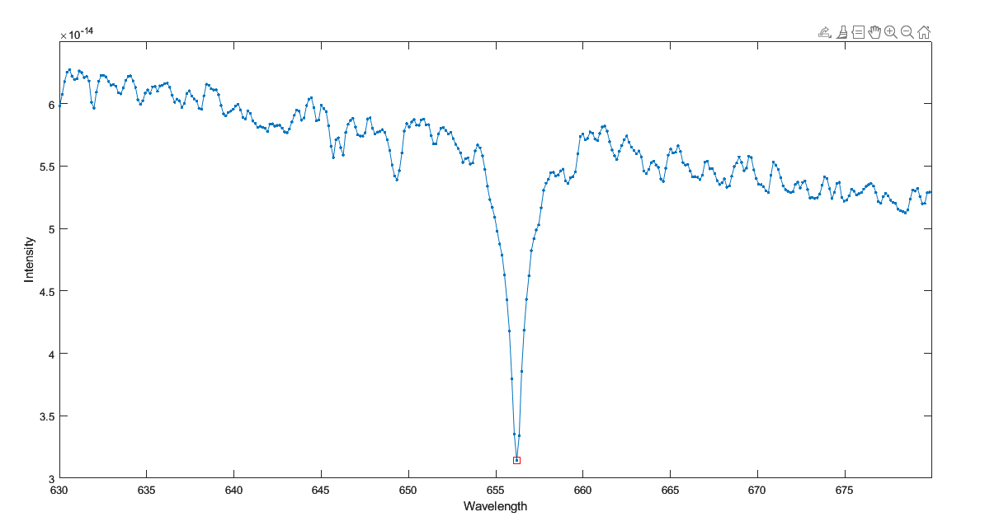
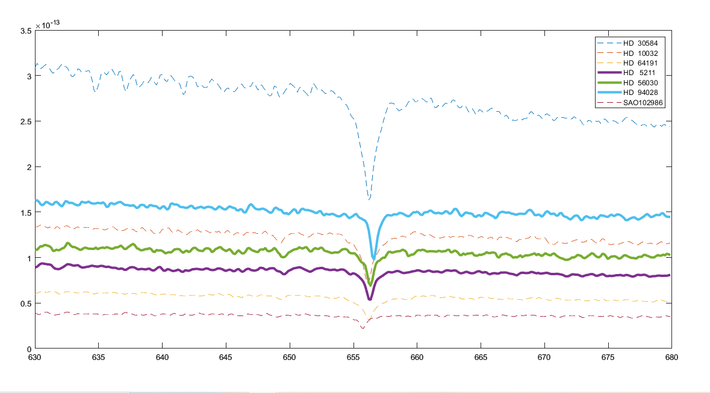
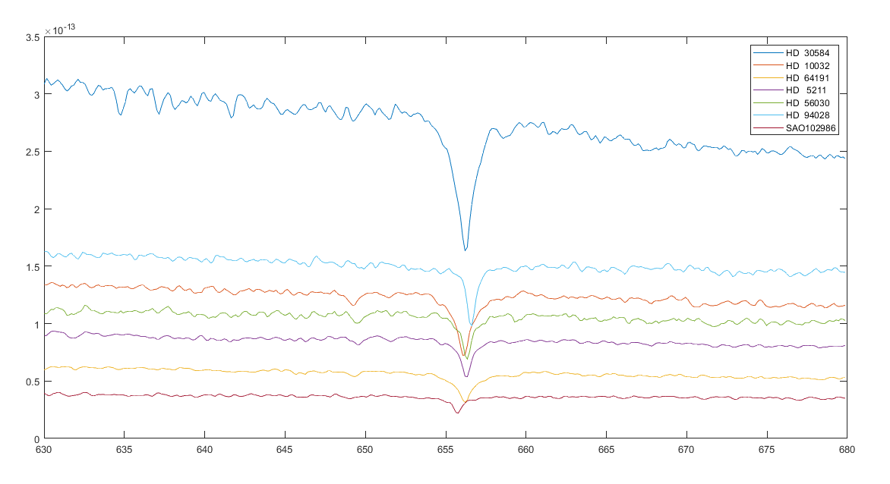

# **Project Stellar Motion I & II**
- *This repository contains the solutions to the Stellar Motion Project 1 & 2 from the MATLAB Onramp course. The projects involve analyzing and visualizing the motion of stars using MATLAB.*

- **Stellar Motion Project 1:**
  - 
- **Stellar Motion Project 2:**
    - 
    - 

## **Project Files**
 - *[Stellar_Motion_Project_1.m](stellar_motion_1.m): MATLAB live script for Stellar Motion Project 1.*
 - *[Stellar_Motion_Project_2.m](stellar_motion_2.m): MATLAB live script for Stellar Motion Project 2.*
 - *[starData.mat](./live_scripts_and_data/starData.mat): MATLAB data file containing star data used in the projects.*
 - *[README.md](README.md): This file.*